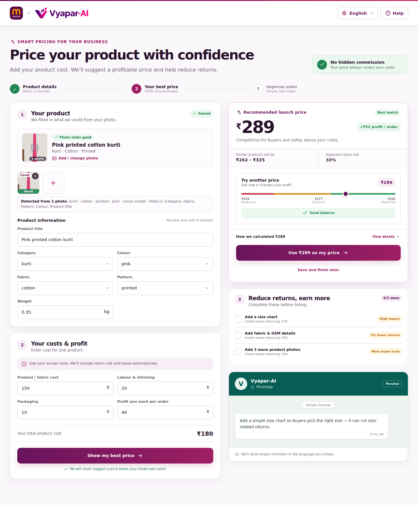
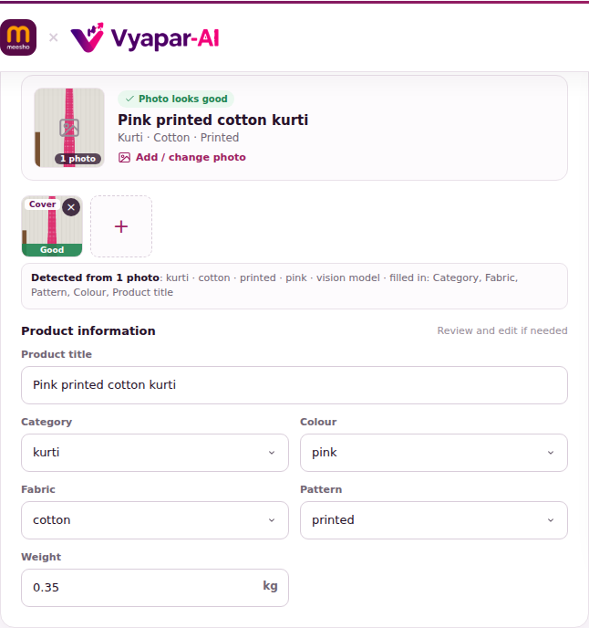
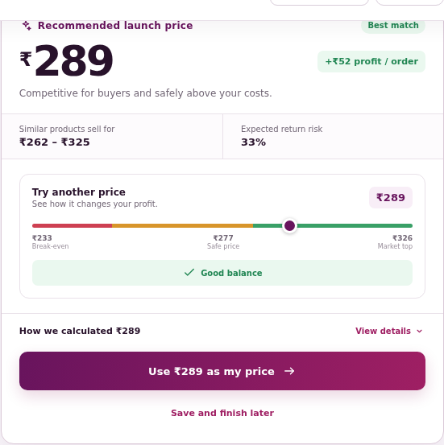
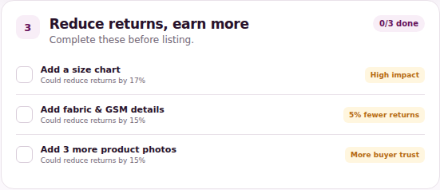
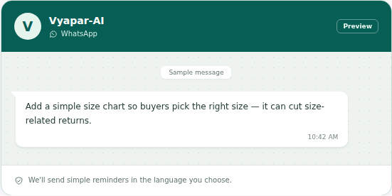
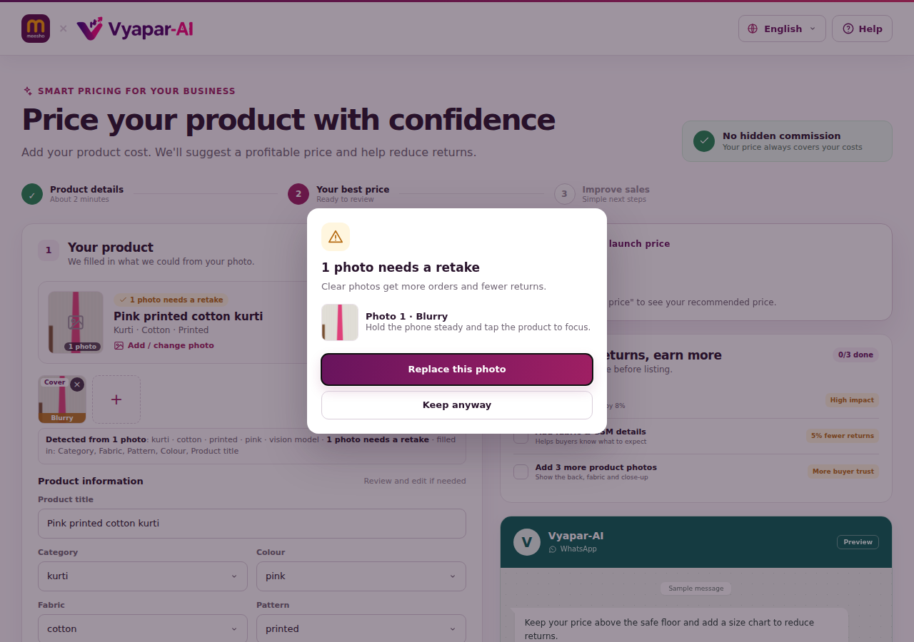
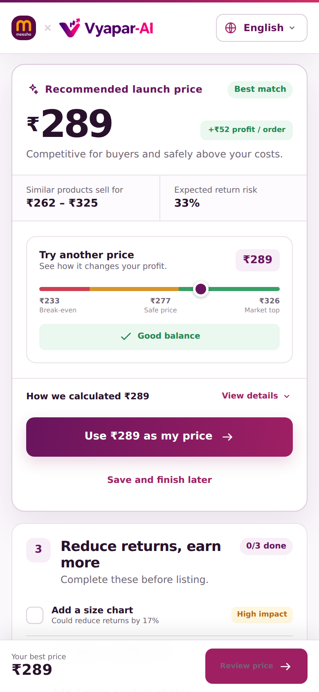
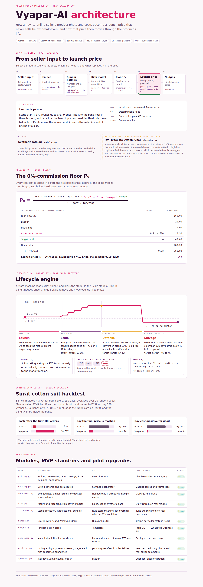

# Vyapar-AI — Pricing Across a Product's Lifecycle (Meesho DICE S3)

Code for Team Imaginating's idea: a **Day-0 pricing engine** and a
**lifecycle re-pricing engine** for new-to-online sellers. It starts from
real costs plus the risk of RTOs and returns, never prices below break-even,
and gives the seller simple Hinglish nudges.

## Screenshots

**Pricing screen.** The seller adds a photo and their costs and gets a launch
price, the price range similar products sell for, the expected return risk, a
price slider marked with break-even, safe price and market top, steps to
reduce returns, and a WhatsApp preview.



| Photo fills in the details | Recommended price |
|---|---|
|  |  |

| Reduce returns | WhatsApp preview |
|---|---|
|  |  |

**Photo check pop-up.** Shown when a photo is blurry, dark, low resolution or
not a product photo, with a one-tap way to replace it.



**On a phone.**



**Architecture page** (`docs/architecture.html`, served at `/architecture`).



> The screenshots use a stand-in vision model, so category, fabric and pattern
> are filled in. Without `VISION_MODEL` set, only the colour and photo-quality
> checks fill in automatically.

## Effort estimate

| Scope | What it includes | Effort |
|---|---|---|
| **MVP (this repo)** | P₀ floor equation, synthetic catalog, similar-listing retrieval + competitor band, return/RTO risk model, lifecycle state machine, LinUCB bandit with guardrails, Hinglish nudges, FastAPI + web UI, Surat backtest simulation | ~1–2 dev-days for a solo dev with an AI assistant; ~1 week for a student team |
| **Pilot** | Real CLIP image embeddings + FAISS, real Meesho catalog/return data, LightGBM retrained daily, WhatsApp Business API, Indic-BERT translation, A/B harness | 3–4 weeks, 2 DS + 1 MLOps (matches Slide 6) |
| **Production** | Integration with the Supplier Panel and pricing service, monitoring, drift detection, a seller-consent flow, scale-out | 2–3 months |

### MVP simplifications (versus the deck)

| Deck component | MVP stand-in | How to upgrade |
|---|---|---|
| CLIP 512-d multimodal vectors | Hashed text + attribute vectors (numpy) | Swap the `Embedder` for `open_clip` |
| FAISS vector index | Exact cosine search in numpy | Change `SimilarityIndex` to use `faiss.IndexFlatIP` |
| Meesho catalog & Valmo logs | Synthetic generator with realistic distributions | Load the real tables into the same `Listing` schema |
| LightGBM risk model | LightGBM (scikit-learn fallback), trained on synthetic data | Retrain on real return history |
| WhatsApp + Indic-BERT | Hinglish templates + a `/nudges` endpoint | Webhook to the WhatsApp Business API |

## Layout

```
vyapar_ai/
  pricing.py     P0 floor equation, launch wedge, guardrails
  catalog.py     synthetic catalog generator (Listing schema)
  retrieval.py   embedder + similarity index + competitor band, with category fallback
  risk.py        return/RTO risk model
  lifecycle.py   Launch → Scale → Defense → Salvage state machine
  bandit.py      LinUCB contextual bandit with P0 / Pmax guardrails
  nudges.py      Hinglish WhatsApp-style action cards
  engine.py      orchestrates the Day-0 pipeline (Slide 6 flow)
  simulator.py   market simulator used for the backtest
api/main.py      FastAPI service + serves the web UI
web/index.html   Day-0 listing interface (Slide 5 wireframe)
scripts/backtest.py  Surat cotton-suit backtest (Slide 8)
tests/           unit tests (worked examples from Slide 3 included)
```

## Quick start

Works on Python 3.9+. Jev (`typesafe-sdk`) needs Python 3.10+; on 3.9 it is
skipped and the rules backend is used instead.

On macOS, LightGBM needs OpenMP: `brew install libomp`. Without it the risk
model falls back to scikit-learn's HistGradientBoosting automatically.

```bash
pip install -r requirements.txt
pytest -q
uvicorn api.main:app --reload     # open http://127.0.0.1:8000
python scripts/backtest.py
```

## API

| Method | Path | Purpose |
|---|---|---|
| `GET` | `/` | Day-0 listing UI (Slide 5 wireframe) |
| `POST` | `/api/day0` | Floor P₀, launch price, competitor band, risk, levers, nudges |
| `POST` | `/api/lifecycle` | Stage detection (launch/scale/defense/salvage), price action, bundles, competitor alert |
| `GET` | `/health` | Instant liveness check for load balancers (e.g. Render's health check path) |
| `GET` | `/api/health` | Status, whether the models are built yet, and the active decision backend |
| `GET` | `/api/subcategories` | Supported taxonomy |
| `POST` | `/api/photos/analyze` | Upload up to 8 photos (multipart `files`): photo-quality checks plus vision-model extraction of category, fabric, pattern, colour, size chart and fabric label |
| `POST` | `/api/price-check` | Margin and verdict (loss / below target / ok / overpriced) for a seller's own price |
| `POST` | `/api/listings` | List the product at a price (in-memory store in the MVP) |
| `GET` | `/api/listings` | Listings created so far |

Interactive docs: `http://127.0.0.1:8000/docs`.

## Backtest result (simulated, Slide 8 scenario)

`python scripts/backtest.py` runs an unstitched cotton suit set from Surat
(COGS ₹220, labour+packaging ₹20, target profit ₹40, band ₹370–₹399)
over 150 simulated days, averaged across 20 random seeds:

| Metric | Manual seller (₹349 → ₹399 on day 120, no fabric card) | Vyapar-AI (P₀ launch + fabric card + LinUCB) |
|---|---|---|
| Launch price | ₹349 | ₹379 (P₀ = ₹367) |
| Day the final price is reached | 120 | ~26 |
| Cash on the first 100 orders | ≈ −₹660 | ≈ +₹3,700 |
| Day the seller is cash-positive for good | ~113 | ~6 |
| Realised return rate | 15% | 8% |

> These numbers come from a **synthetic** market model (`vyapar_ai/simulator.py`),
> not real Meesho data. They show the mechanism works; they are not a claim
> about real-world impact.

## Jev decision layer (`vyapar_ai/decision.py`)

[Jev](https://typesafe.ai/blog/introducing-system-one-models-and-jev) is TypeSafe AI's
System One model: unstructured state in, typed decisions with calibrated
confidence out. Vyapar-AI sends it these questions in one call:

| Question | Type | Effect |
|---|---|---|
| `listing_ambiguity` | Score 1–5 | Scales the predicted return rate (0.85× to 1.15×), the "visual ambiguity score" from Slide 6 |
| `return_reason` | Choice | Reads buyer comments (Hindi, Hinglish or English) and puts the matching fix first (size chart, fabric card or photos) |
| `lifecycle_stage` | Choice | `/api/lifecycle` uses it only at ≥ 70% confidence; otherwise the state machine decides |

```bash
cp .env.example .env               # then set TYPESAFE_API_KEY (early access: https://console.typesafe.ai)
pip install python-dotenv
uvicorn api.main:app --env-file .env
```

With no key set, or if the API fails, a deterministic rules backend answers the
same questions, so pricing never blocks. Jev never sets a price itself: the
P ≥ P₀ and P ≤ Pmax guardrails stay in code. `GET /api/health` reports which
backend is active.

## Photo extraction (`vyapar_ai/vision.py`)

Sellers can upload product photos in the form. The details are filled in automatically and the seller reviews them before pricing.

| Layer | Runs | Gives |
|---|---|---|
| Photo checks (Pillow + numpy) | Always, no model needed | Resolution, brightness, blur, main colour, photo count |
| Doc-AI digitise | When `DOC_AI_API_KEY` is set | The text on the photos (fabric/GSM labels, size charts), used as a hint for the model |
| Vision model | When `VISION_MODEL` and `VISION_API_KEY` are set | Sub-category, fabric, pattern, colour, size chart visible, fabric/GSM label visible, which shots exist, a suggested title |

The vision model is called through an OpenAI-compatible `/chat/completions`
endpoint, with images sent as `image_url` data URLs and a JSON schema for the
answer. That fits Sarvam's API (`VISION_API_BASE=https://api.sarvam.ai/v1`) or
a self-hosted model. The model's answer is checked against the allowed values,
and anything unexpected is dropped. If the call fails, the photo checks still
answer. Photo problems (blurry, dark, small) slightly raise the predicted return
rate, and the seller sees them in a photo-check pop-up with a one-tap way to
replace the photo.

### Doc-AI digitise step (`vyapar_ai/vision.py`)

When `DOC_AI_API_KEY` is set, each photo is digitised by Sarvam's Doc-AI job API
before the vision model sees it: the photo goes to `/doc-ai/v1/job/digitise`
(with an `Idempotency-Key` so retries are safe), the job is polled at
`/doc-ai/v1/job/{id}/status` until it reaches a terminal state, and the rendered
HTML is fetched from the URL minted by `/doc-ai/v1/job/{id}/download-url`. The
text Doc-AI reads (fabric/GSM labels, size charts, any printed matter) is passed
to the vision model alongside the images as a hint, so the model gets both the
OCR text and the picture. If the Doc-AI step fails, the model still runs on the
images alone, and if that fails the pixel checks still answer.


OCR is not needed. Attributes come from what the photo shows. Reading printed
measurements on a size chart would be an OCR or document-model step, which
could be added later.

## Architecture page

`docs/architecture.html` is an interactive diagram of the whole system, also
served at `http://127.0.0.1:8000/architecture`.
